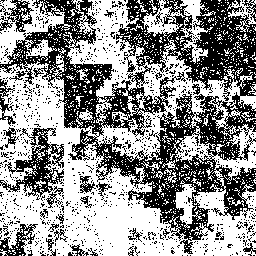

Btrfs Heatmap
=============

The btrfs heatmap script creates a visualization of how a btrfs filesystem is using the underlying raw disk space of the block devices that are added to it.

## What does it look like?

238GiB file system |
:--------------------------:|
|


This picture shows the 238GiB filesystem in my computer at work. It was generated using the command `./heatmap.py --size 8 /`, resulting in a 256x256 pixel png. The black parts are unallocated disk space. Raw disk space that is allocated to be used for data or metadata gets brighter if the fill factor of block groups is higher.

```
Label: none  uuid: ed10a358-c846-4e76-a071-3821d423a99d
    Total devices 1 FS bytes used 132.74GiB
    devid    1 size 237.54GiB used 152.01GiB path /dev/mapper/sda2_crypt
```

The filesystem has 152.01GiB of the 237.54GiB allocated, in which actually only 132.74GiB is used. The picture gives an idea about the distribution of that data inside the allocated space.

The ordering inside the picture is based on a [Hilbert Curve](https://en.wikipedia.org/wiki/File:Hilbert_curve.svg). The lowest physical address of the block devices is located in the bottom left corner. From there it walks up, to the right and down again.

## Can I see usage in more detail?

The filesystem level only displays a certain greyscale value for entire block groups. By specifying a block group address, we can also get a view on the distribution of data inside a single block group. This shows for example how fragmented the free space inside the block group is.

1GiB DATA block group    | 1GiB METADATA block group
:-------------------------:|:-------:|
  | 

I used [`show_block_groups.py`](https://github.com/knorrie/python-btrfs/blob/master/examples/show_block_groups.py), one of the small examples programs that you can find in [python-btrfs](https://github.com/knorrie/python-btrfs), to list all block groups in the filesystem, and then chose two of them:

```
block group vaddr 163229728768 length 1073741824 flags DATA used 370114560 used_pct 34
block group vaddr 20971520 length 1073741824 flags METADATA used 612417536 used_pct 57
```

Then I created the images using the following commands:

```
-# ./heatmap.py --blockgroup 163229728768 --size 8 /
-# ./heatmap.py --blockgroup 20971520 --size 8 /
```

For size 8, I get a picture with height and witdth of 256 pixels, which means that to view a total of 1GiB, each pixel represents 16kiB of data.

## More usage instructions!

The code in here has one dependency, which is the [python-btrfs](https://github.com/knorrie/python-btrfs) library (>= v0.3), used to gather all usage information.

The program has a built in help function that shows the options it accepts:

```
usage: heatmap.py [-h] [--order ORDER] [--size SIZE] [--blockgroup BLOCKGROUP]
                  [-v] [-o PNGFILE]
                  mountpoint

positional arguments:
  mountpoint            Btrfs filesystem mountpoint

optional arguments:
  -h, --help            show this help message and exit
  --order ORDER         Hilbert curve order (default: automatically chosen)
  --size SIZE           Image size (default: 10). Height/width is 2^size
  --blockgroup BLOCKGROUP
                        Instead of a filesystem overview, show extents in a
                        block group
  -v, --verbose         increase debug output verbosity (-v, -vv, -vvv, etc)
  -o PNGFILE, --output PNGFILE
                        Output png file name or directory (default: filename
                        automatically chosen)
```

So, creating an image can be done by pointing `heatmap.py` to a mounted filesystem, for example `./heatmap.py /home`. By default, the filename for the png is chosen automatically, containing the ID of the filesystem, optionally a block group address, and a timestamp, for example `fsid_ed10a358-c846-4e76-a071-3821d423a99d_blockgroup_20971520_at_1479165679.png`.

And, because the needed information is retrieved using the btrfs kernel API, it has to be run as root. :|

## Why did you create this program?

For fun! `\:D/`

And if gets even more fun when you take multiple pictures and compare them, for example before and after, or even during playing around with `btrfs balance`.

If the filesystem being observed is not too big, it can be fun and educating to just do `watch './heatmap.py -o samefile.png /mountpoint'` and open an image viewer program that automatically refreshes the image when a new one is written. Also, doing `watch -d '.../python-btrfs/examples/show_block_groups.py /mountpoint'` in another terminal shows the data moving around ordered by logical addresses of the block groups.

On a few filesystems, I have a cron job set up which generates a picture every day, so I can turn them into a movie that shows data being added, removed and moved around over time.

Here's an example of a video of a 2TiB filesystem (links to a video on youtube):

[](https://youtu.be/Qj1lxAasytc)

Here's the command used to create an mp4 video out of all the pngs:

```
ffmpeg -framerate 2 -pattern_type glob -i '*.png' -c:v libx264 -r 30 -pix_fmt yuv420p out.mp4
```

Have fun!
Knorrie
