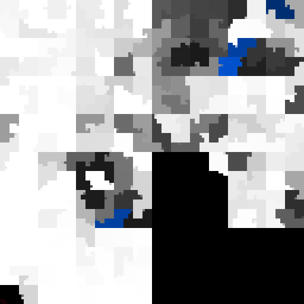
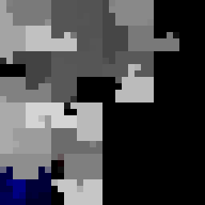
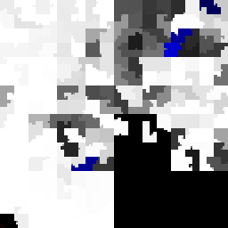

Btrfs Heatmap
=============

The btrfs heatmap script creates a visualization of how a btrfs filesystem is
using the underlying disk space of the block devices that are added to it.

## What does it look like?

238GiB file system |
:--------------------------:|
|


This picture shows the 238GiB filesystem in my computer at work. It was
generated using the command `btrfs-heatmap --size 9 /`, resulting in a 512x512
pixel png. The black parts are unallocated disk space. Raw disk space that is
allocated to be used for data (white), metadata (blue) or system (red) gets
brighter if the fill factor of block groups is higher.

## How do I create a picture like this of my own computer?

Well, first install the program. It's probably available as package
'btrfs-heatmap' in your favourite Linux distro.

When pointing btrfs-heatmap to a mounted btrfs filesystem location, it will ask
the linux kernel for usage information and build a png picture reflecting that
low level information.  Because the needed information is retrieved using the
btrfs kernel API, it has to be run as root user:

```
-$ sudo btrfs-heatmap /mountpoint
```

## I have a picture now, with quite a long filename, why?

The filename of the png picture is a combination of the filesystem ID and a
timestamp by default, so that if you create multiple of them, they nicely pile
up as input for creating a timelapse video.

Creating multiple ones is as easy as doing `watch 'btrfs-heatmap /mountpoint'`

## Can I directly view the resulting image?

Yes! For this, output to stdout can be used. When using a dash as output
filename (`-o -`), the resulting png data is written to stdout directly, which
can be connected to an image viewer like `catimg` for displaying the image
right away in a terminal screen using ansi color codes. For a pop up window, a
program like `feh` can be used.

A typical use case for using this functionality and `catimg` is to conveniently
view results on a remote server without having to copy resulting png files
around.

## Where's what? In what corner is the first or last byte located?

By default, the ordering inside the picture is based on a [Hilbert
Curve](doc/curves.md).  The lowest physical address of the block devices is
located in the bottom left corner.  From there it walks up, to the right and
down again.

Hilbert Curve | Example Image
:------------:|:----------:
[](doc/curves.md)|[](doc/curves.md)

## In btrfs technical terms speaking, what does it display?

The picture that is generated by default shows the physical address space of a
filesystem, by walking all dev extents of all devices in the filesystem using
the search ioctl and concatenating all information into a single big image. The
usage values are computed by looking up usage counters in the block group items
from the extent tree.

It's also possible to have the picture sorted by btrfs virtual address space
instead, or to create pictures of the contents of block groups, on extent
level. For more information, see links to additional documentation below.

## How do I create a timelapse movie out of this?

Here's an example command to create an mp4 video out of all the png files if
you create multiple ones over time:
```
ffmpeg -framerate 2 -pattern_type glob -i '*.png' -c:v libx264 -r 25 -pix_fmt yuv420p btrfs-heatmap.mp4
```
By varying the `-framerate` option, you can make the video go faster or slower.

Another option is to create an animated gif. By varying the `-delay` option,
you change the speed.
```
convert -layers optimize-frame -loop 0 -delay 20 *.png btrfs-heatmap.gif
```

The next picture is an animated gif of running `btrfs balance` on the data of
the filesystem which the first picture was also taken of. You can see how all
free space is defragmented by packing data together:

btrfs balance |
:--------------------------:|
|

## More documentation and advanced usage

* The built-in `--help` option will show all functionality that is available
  through the command line.
* Different ways to walk the pixel grid: [Hilbert, Snake, Linear](doc/curves.md).
* Sorting the picture on [virtual instead of physical address space](doc/sort.md).
* [Extent level pictures](doc/extent.md) show detailed usage of the virtual
  address space inside block groups.
* By [scripting btrfs-heatmap](doc/scripting.md) it's possible to make pictures
  of single devices, or any combination of block groups.

## Feedback

Let me know if this program was useful for you, or if you have brilliant ideas
about how to improve it.

You can reach me on IRC in #btrfs on Freenode (I'm Knorrie), use the github
issue system or send me an email on hans@knorrie.org
