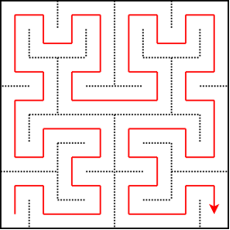
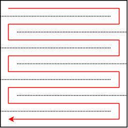
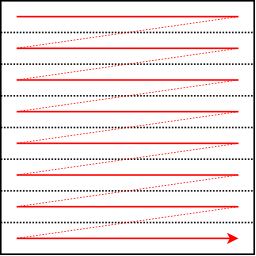
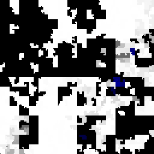
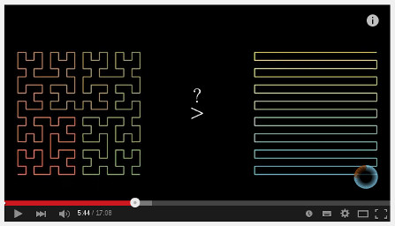
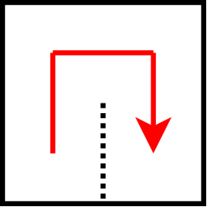
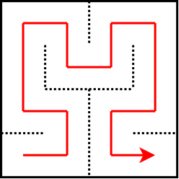

Btrfs Heatmap - Curves
======================

When displaying the layout of data in a filesystem, we have to keep in mind
that, either when following the physical or virtual address space, we're actually
following a linear address space.

Linear address space |
:----------: |
 |

Because it's quite impractical to generate an image that is only one pixel
high, and really really wide, we want to make it a bit more rectangular.

### What's this Hilbert thing about?

The [Hilbert Curve](https://en.wikipedia.org/wiki/Hilbert_curve) is a space filling curve
that has a characteristic of folding the long linear line into a square picture in a
way that tries to keep as much idea of locality of data as possible.

Hilbert | Snake | Linear |
:------:|:------:|:-------:
 |  | 

Here's an example of a filesystem level picture generated with all three. If
you want to have pictures generated with a `linear` or `snake` way of walking
the pixel grid, then you can specify the option `--curve linear` or `--curve
snake` to the btrfs-heatmap program.

Hilbert | Snake | Linear |
:------:|:------:|:------:
 |  | 

I personally like the Hilbert picture better. It's showing blocks of data with
their usage gradient in a much more convenient way.

Besides this, changing the order of detail of snake or linear pictures also
behaves different than the Hilbert one, When changing the order of the hilbert
curve, to make it more detailed, the picture also looks the same, but with more
detail. For snake and linear, data starts moving around much more.

Someone else made a very nice visual explanation of this, which you can see in
a video that's available on Youtube, done by 3Blue1Brown. At least watch it
from 5'18" (where it starts, from the external link below), to 7'8".

### Hilbert curve 'orders'

1st order | 2nd order | 3rd order |
:------:|:------:|:------:
 |  | 

Well, the easiest way to explain is to show it. When increasing the order of the curve,
you get a curve that walks the pixel grid which we're filling in more detail by
replicating itself in more detail.

The video linked above also explains the concept of curve orders, in the beginning.

Hilbert Curve, order 5 |
:------:|
 |

While this animation already looks quite complex, it's only a 32 by 32 pixel
area.

But, the fun thing is, even when looking at an order 10 picture, which has 1024
by 1024 pixels, the basic idea about the curve going up, to the right and down,
and then only getting more detailed in between keeps standing. That's what I
like about it.
