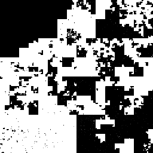

Btrfs Heatmap - Extent level pictures
=====================================

The filesystem level only displays a certain greyscale value for entire block
groups. By specifying a block group address, we can also get a view on the
distribution of data and metadata inside a single block group. This shows for
example how fragmented the free space inside the block group is.

1GiB DATA block group    | 512MiB DUP METADATA block group
:-------------------------:|:-------:|
  | 

Metadata tree blocks get colored depending on the tree they belong to:

 Color | Tree | Color | Tree |
:-----:|:----:|:-----:|:----:|
 | ROOT (1) |  | CSUM (7) |
 | EXTENT (2) |  | QUOTA (8) |
 | CHUNK (3) |  | UUID (9) |
 | DEV (4) |  | FREE SPACE (10) |
 | FS (5, 256+) |  | DATA RELOC (-9) |

The `btrfs-heatmap` program can take a `--blockgroup` argument, which needs a
vaddr of a block group as argument.

Here's a small program that uses python-btrfs to list of all block groups in a
filesystem (from `examples/show_block_groups.py` in python-btrfs):

```python
#!/usr/bin/python3
import btrfs
import sys
fs = btrfs.FileSystem(sys.argv[1])
for chunk in fs.chunks():
    print(fs.block_group(chunk.vaddr, chunk.length))
```

Example part of the output:

```
-# ./show_block_groups.py /
block group vaddr 722187845632 transid 1871184 length 536870912 flags METADATA|DUP used 409714688 used_pct 76
block group vaddr 783391129600 transid 1851697 length 1073741824 flags DATA used 573911040 used_pct 53
```

Then I created the images using the following commands:

```
-# btrfs-heatmap --blockgroup 722187845632 --size 8 /
max_id 1 num_devices 1 fsid 64ac42f5-4ff7-4be0-b94a-90def45e6c1e nodesize 16384 sectorsize 4096 clone_alignment 4096
scope block_group 722187845632
grid order 8 size 8 height 256 width 256 total_bytes 536870912 bytes_per_pixel 8192.0
pngfile fsid_64ac42f5-4ff7-4be0-b94a-90def45e6c1e_blockgroup_722187845632_at_1484322493.png

-# btrfs-heatmap --blockgroup 783391129600 --size 8 /
max_id 1 num_devices 1 fsid 64ac42f5-4ff7-4be0-b94a-90def45e6c1e nodesize 16384 sectorsize 4096 clone_alignment 4096
scope block_group 783391129600
grid order 8 size 8 height 256 width 256 total_bytes 1073741824 bytes_per_pixel 16384.0
pngfile fsid_64ac42f5-4ff7-4be0-b94a-90def45e6c1e_blockgroup_783391129600_at_1484322668.png
```

Also note:
* These are pictures from the virtual address space. The DUP in the header of
  the metdata picture doesn't mean much.
* By default, size of pictures is 10 (2^10=1024 width/height). I used 8 to make
  them smaller for the documentation page.

Next: [Scripting btrfs-heatmap](scripting.md)
