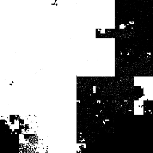
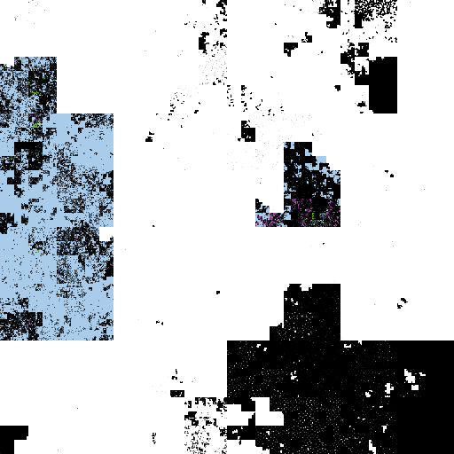

Btrfs Heatmap - Scripting
=========================

When doing something more sophisticated than just creating a picture of a
complete filesystem or a single block group, it's better to do it from python
and use the btrfs library to find the objects that we want to display.

The btrfs-heatmap code is not a full-blown library, but that doesn't prevent us
from importing the code from another script in the same directory and then
using functions from it. In order to be able to do this, I recommend just
making a symlink to the btrfs-heatmap program in the location where you're
writing the new script. This is a bit clumsy, but it's what it is, for now.

```
-$ ln -s $(which btrfs-heatmap) heatmap.py
```

After doing this, we can simply `import heatmap` in our new script.

First, we'll have a look at some interesting fuctions inside the code,
after which I'll show some examples of how to use them.

## 1. Internal btrfs-heatmap functions

### 1.1 Working with devices, dev extent level picture

```python
walk_dev_extents(fs, devices=None, order=None, size=None,
                 default_granularity=33554432, verbose=0,
                 min_brightness=None, curve=None)
```

 * `fs` is a btrfs.FileSystem object.
 * `devices` is a list of one or more device objects (`btrfs.ctree.DevItem`),
   or `None` to automatically use all of them.
 * `order` defines the hilbert curve order. Most of the time it's best to let
   it be determined automatically. A higher number will result in a more
   detailed picture, with less bytes per pixel.
 * `size` defines the size of the output image. By default, this is 10, which
   means a picture with a height and width of 1024 (2^10). If the size argument
   is higher than the curve order, pixels are simply duplicated when writing
   out the png picture.
 * `default_granularity` defines the amount of bytes that should be mapped
   (approximately) on a single pixel in the output to determine the hilbert
   curve order to use. By default, this is 32MiB.
 * A higher number for `verbose` makes the output more verbose (like `-vvv` on
   the command line of `btrfs-heatmap` would be `verbose=3`).
 * `min_brightness` (0 <= `min_brightness` <= 1, default 0.1) sets the minimal
   brightness of pixels that are part of allocated space, to be able to
   distinguish them from unallocated space when usage is really low.
 * `curve` is either 'hilbert' (the default), 'snake', or 'linear'

### 1.2 The virtual address space, chunk level picture

```python
walk_chunks(fs, devices=None, order=None, size=None, default_granularity=33554432,
            verbose=0, min_brightness=None, curve=None)
```

  * for all options, see above

### 1.3 Working with block groups, extent level picture

```python
walk_extents(fs, block_groups, order=None, size=None,
             default_granularity=None, verbose=0, curve=None)
```

 * `block_groups` is a list of one or multiple block group objects.
 * For block group internals, `default_granularity` defaults to the sector size
   of the filesystem, which is often 4096 bytes.
 * for other options, see above

### 1.4 A helper for generating file names

```python
generate_png_file_name(output=None, parts=None)
```

 * `parts` is a list of filename parts that will be concatenated, after which a
   timestamp is also added.  e.g. `parts=['foo', 'bar']` results in
   `foo_bar_at_1482095269.png`
 * `output` can be a filename, in which case the function just returns that
   filename again
 * `output` can be a directory, in which case the function will return a path
   to an autogenerated filename using parts in that directory

## 2. Examples

### 2.1 Full filesystem image

The following is the equivalent of doing `btrfs-heatmap --size 8 -o full-fs.png
/`:

```python
#!/usr/bin/python3
import btrfs
import heatmap
fs = btrfs.FileSystem('/')
heatmap.walk_dev_extents(fs, size=8).write_png('full-fs.png')
```

output:
```
scope device 1
grid order 5 size 8 height 32 width 32 total_bytes 21474836480 bytes_per_pixel 20971520.0
pngfile full-fs.png
```

20 GiB file system    |
:-------------------------:|
 |

### 2.2 The four newest DATA block groups together

```python
#!/usr/bin/python3
import btrfs
import heatmap
fs = btrfs.FileSystem('/')
four_newest_bg = [fs.block_group(chunk.vaddr, chunk.length)
                  for chunk in fs.chunks()
                  if chunk.type & btrfs.BLOCK_GROUP_DATA][-4:]
grid = heatmap.walk_extents(fs, four_newest_bg)
parts = ['fsid', fs.fsid, 'startat', four_newest_bg[0].vaddr]
png_filename = heatmap.generate_png_file_name('/output/directory/', parts=parts)
grid.write_png(png_filename)
```

output:
```
scope block_group 154696417280 155770159104 156843900928 157917642752
grid order 8 size 8 height 256 width 256 total_bytes 4294967296 bytes_per_pixel 65536.0
pngfile fsid_9881fc30-8f69-4069-a8c8-c057b842b0c4_startat_154696417280_at_1484406586.png
```

This example uses the png file name generator helper which adds a timestamp so
we can easily repeat it to get images which can be put together into a timelapse.

4 newest DATA block groups    |
:-------------------------:|
 |

### 2.3 Show usage, separate image per device, more verbose output

The following script generates a separate picture per physical device. Since this is
a very small filesystem, we use mode linear to make it look a bit more like norton
disk defragmenter.

```python
#!/usr/bin/python3
import btrfs
import heatmap
fs = btrfs.FileSystem('/mnt/raid0')
for device in fs.devices():
    grid = heatmap.walk_dev_extents(fs, [device], curve='linear', size=8, verbose=1)
    grid.write_png('device_%s.png' % device.devid)
```

output:
```
scope device 1
grid curve hilbert order 4 size 8 height 16 width 16 total_bytes 5368709120 bytes_per_pixel 20971520.0
dev_extent devid 1 paddr 20971520 length 8388608 pend 29360127 type SYSTEM|RAID1 used_pct 0.20
dev_extent devid 1 paddr 29360128 length 1073741824 pend 1103101951 type METADATA|RAID1 used_pct 0.50
dev_extent devid 1 paddr 1103101952 length 1073741824 pend 2176843775 type DATA used_pct 96.10
dev_extent devid 1 paddr 3250585600 length 1073741824 pend 4324327423 type DATA used_pct 87.01
dev_extent devid 1 paddr 4324327424 length 1044381696 pend 5368709119 type DATA used_pct 76.09
pngfile device_1.png

scope device 2
grid curve hilbert order 4 size 8 height 16 width 16 total_bytes 5368709120 bytes_per_pixel 20971520.0
dev_extent devid 2 paddr 1048576 length 8388608 pend 9437183 type SYSTEM|RAID1 used_pct 0.20
dev_extent devid 2 paddr 9437184 length 1073741824 pend 1083179007 type METADATA|RAID1 used_pct 0.50
dev_extent devid 2 paddr 1083179008 length 536870912 pend 1620049919 type DATA used_pct 50.00
dev_extent devid 2 paddr 1620049920 length 1073741824 pend 2693791743 type DATA used_pct 96.03
dev_extent devid 2 paddr 2693791744 length 1073741824 pend 3767533567 type DATA used_pct 50.00
dev_extent devid 2 paddr 3767533568 length 1073741824 pend 4841275391 type DATA used_pct 25.00
dev_extent devid 2 paddr 4841275392 length 527433728 pend 5368709119 type DATA used_pct 18.58
pngfile device_2.png
```

Dev Extents on device 1 | Dev Extents on device 2
:------------------:|:-------------------:
| | 

### 2.4 Show virtual address space, separate image per device

This one is very similar to the previous example, but it shows the amount of used space
on each device that is attached to the filesystem sorted on virtual address space.

In addition, it lowers the resolution a bit from what would be chosen
automatically (4 instead of 5), chooses a snake curve instead of hilbert and
bumps the minimal brightness a bit, since the metadata part is almost
completely empty.

```python
#!/usr/bin/python3
import btrfs
import heatmap
fs = btrfs.FileSystem('/mnt/btrfs')
for device in fs.devices():
    grid = heatmap.walk_chunks(fs, [device], order=4, size=8, curve='snake',
                               verbose=2, min_brightness=0.3)
    grid.write_png('stripes_on_device_%s.png' % device.devid)
```

output:
```
scope chunk stripes on devices 1
grid curve snake order 4 size 8 height 16 width 16 total_bytes 5368709120 bytes_per_pixel 20971520.0
block group vaddr 20971520 transid 23 length 8388608 flags SYSTEM|RAID1 used 16384 used_pct 0
chunk vaddr 20971520 type SYSTEM|RAID1 length 8388608 num_stripes 2
    stripe devid 1 offset 20971520
    in_pixel 0 40.00%
block group vaddr 29360128 transid 23 length 1073741824 flags METADATA|RAID1 used 7684096 used_pct 1
chunk vaddr 29360128 type METADATA|RAID1 length 1073741824 num_stripes 2
    stripe devid 1 offset 29360128
    first_pixel 0 60.00% last_pixel 51 60.00%
block group vaddr 3250585600 transid 23 length 1073741824 flags DATA used 1031831552 used_pct 96
chunk vaddr 3250585600 type DATA length 1073741824 num_stripes 1
    stripe devid 1 offset 1103101952
    first_pixel 51 40.00% last_pixel 102 80.00%
block group vaddr 5398069248 transid 23 length 1073741824 flags DATA used 1071894528 used_pct 100
chunk vaddr 5398069248 type DATA length 1073741824 num_stripes 1
    stripe devid 1 offset 2176843776
    first_pixel 102 20.00% last_pixel 153 100.00%
block group vaddr 7545552896 transid 23 length 1073741824 flags DATA used 934223872 used_pct 87
chunk vaddr 7545552896 type DATA length 1073741824 num_stripes 1
    stripe devid 1 offset 3250585600
    first_pixel 154 100.00% last_pixel 205 20.00%
block group vaddr 8619294720 transid 23 length 1044381696 flags DATA used 794705920 used_pct 76
chunk vaddr 8619294720 type DATA length 1044381696 num_stripes 1
    stripe devid 1 offset 4324327424
    first_pixel 205 80.00% last_pixel 254 100.00%
pngfile stripes_on_device_1.png

scope chunk stripes on devices 2
grid curve snake order 4 size 8 height 16 width 16 total_bytes 5368709120 bytes_per_pixel 20971520.0
block group vaddr 20971520 transid 23 length 8388608 flags SYSTEM|RAID1 used 16384 used_pct 0
chunk vaddr 20971520 type SYSTEM|RAID1 length 8388608 num_stripes 2
    stripe devid 2 offset 1048576
    in_pixel 0 40.00%
block group vaddr 29360128 transid 23 length 1073741824 flags METADATA|RAID1 used 7684096 used_pct 1
chunk vaddr 29360128 type METADATA|RAID1 length 1073741824 num_stripes 2
    stripe devid 2 offset 9437184
    first_pixel 0 60.00% last_pixel 51 60.00%
block group vaddr 2176843776 transid 23 length 1073741824 flags DATA used 1030082560 used_pct 96
chunk vaddr 2176843776 type DATA length 1073741824 num_stripes 1
    stripe devid 2 offset 1620049920
    first_pixel 51 40.00% last_pixel 102 80.00%
block group vaddr 4324327424 transid 23 length 1073741824 flags DATA used 1040887808 used_pct 97
chunk vaddr 4324327424 type DATA length 1073741824 num_stripes 1
    stripe devid 2 offset 2693791744
    first_pixel 102 20.00% last_pixel 153 100.00%
block group vaddr 6471811072 transid 23 length 1073741824 flags DATA used 871952384 used_pct 81
chunk vaddr 6471811072 type DATA length 1073741824 num_stripes 1
    stripe devid 2 offset 3767533568
    first_pixel 154 100.00% last_pixel 205 20.00%
block group vaddr 9663676416 transid 23 length 536870912 flags DATA used 268435456 used_pct 50
chunk vaddr 9663676416 type DATA length 536870912 num_stripes 1
    stripe devid 2 offset 1083179008
    first_pixel 205 80.00% last_pixel 230 80.00%
block group vaddr 10200547328 transid 23 length 527433728 flags DATA used 98013184 used_pct 19
chunk vaddr 10200547328 type DATA length 527433728 num_stripes 1
    stripe devid 2 offset 4841275392
    first_pixel 230 20.00% last_pixel 255 95.00%
pngfile stripes_on_device_2.png
```

Stripes on device 1 | Stripes on device 2 
:------------------:|:-------------------:
| | 

### 2.5 Detailed picture of a full filesystem

```python
#!/usr/bin/python3

import btrfs
import heatmap

fs = btrfs.FileSystem('/')
bgs = [fs.block_group(chunk.vaddr, chunk.length)
       for chunk in fs.chunks()]
grid = heatmap.walk_extents(fs, bgs, size=9)
parts = ['fsid', fs.fsid, 'all_bg']
png_filename = heatmap.generate_png_file_name(parts=parts)
grid.write_png(png_filename)
```

output:
```
scope block_group 87285563392 87319117824 89466601472 90540343296 90808778752 91077214208
    91345649664 91614085120 91882520576 92150956032 122215727104 123289468928 130000355328
    154696417280 155770159104 156843900928 157917642752
grid order 9 size 9 height 512 width 512 total_bytes 11576279040 bytes_per_pixel 44160.0
pngfile fsid_9881fc30-8f69-4069-a8c8-c057b842b0c4_all_bg_at_1484409171.png
```

Note that the following picture, while being taken of the same filesystem as the 'full fs'
picture in the first example, has a very different ordering. The block groups in the virtual
address space do not have to map to the same order as allocated chunks of disk.

And, because the picture shows all block groups, it does not show any
unallocated raw disk space.

I used size 9 in this example, to get a picture that would fit into this page.
When specifying a higher hilbert curve order (like 11, or maybe even 12), a
very detailed, but very big picture can be made.

All block groups    |
:-------------------------:|
 |
