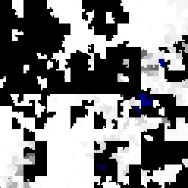
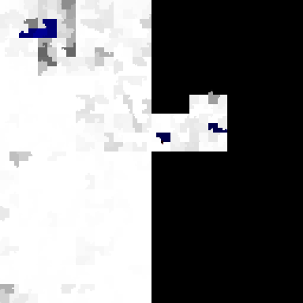

Btrfs Heatmap - Physical and virtual address space
==================================================

By default, the heatmap script produces a picture that shows allocated and used
space sorted in the order in which the allocated chunks are present on actual
underlying disk storage.

By specifying the option `--sort virtual`, we can sort the same information
based on the internal virtual addressing instead.

When quickly wanting to find out how filled up a filesystem is, this can be
quite useful, since unallocated space is not scattered around the whole
picture, but pushed to the back.

The longest living block groups are sorted near the beginning, which gives an
idea about how much fragmented free space that is not being reused by btrfs is
left behind over time.

Physical    | Virtual
:---------------:|:----:
 | 

## Virtual address space

The virtual address space of a btrfs filesystem is a space which gets extended
every time a chunk of raw disk space gets allocated to be used for data or
metadata. While unallocted physical space gets reused all the time, virtual
address space is never reused and will only grow further into higher numbers.

When btrfs wants to allocate free physical space into new virtual address
space, it will always choose the first free part of physical unallocated space
on the attached block device that has the most unallocated raw space of all of
them.

When looking closely at the 'btrfs balance' animated picture on the frontpage
of this documentation, you can actually see this happen.

## Mappings between physical and virtual space

A simple way to determine what the physical and virtual address space of a
filesystem looks like, is to dump the information of either `dev_extents` or
`chunks`.

### dev\_extent

The `dev_extent` objects live in tree number 4, the device tree. For each piece
of raw disk space that is in use, on each device, there's an object in the tree
that points to a device, shows an address and length and lists the associated
chunk in the virtual address space this piece of physical disk space belongs
to.

The following small filesystem (which is not the filesystem the pictures above
have been taken from) only has one block device attached, and you can see that
the physical addresses and the length of the allocated space maps to chunks
that vary wildy all around the virtual address space.

```
-# python3
>>> import btrfs
>>> fs = btrfs.FileSystem('/')
>>> for dev_extent in fs.dev_extents():
...     print(dev_extent)
...
dev extent devid 1 paddr 1048576 length 268435456 chunk 21663580160
dev extent devid 1 paddr 269484032 length 268435456 chunk 21932015616
dev extent devid 1 paddr 537919488 length 268435456 chunk 22200451072
dev extent devid 1 paddr 806354944 length 1073741824 chunk 86982524928
dev extent devid 1 paddr 1880096768 length 268435456 chunk 36427530240
dev extent devid 1 paddr 2148532224 length 268435456 chunk 84298170368
dev extent devid 1 paddr 2416967680 length 268435456 chunk 85640347648
dev extent devid 1 paddr 2896691200 length 1073741824 chunk 32132562944
dev extent devid 1 paddr 3970433024 length 1073741824 chunk 89130008576
dev extent devid 1 paddr 5256511488 length 33554432 chunk 21630025728
dev extent devid 1 paddr 5290065920 length 1073741824 chunk 85908783104
dev extent devid 1 paddr 6363807744 length 1073741824 chunk 90203750400
dev extent devid 1 paddr 7549222912 length 1073741824 chunk 22468886528
dev extent devid 1 paddr 8622964736 length 1073741824 chunk 91277492224
dev extent devid 1 paddr 9696706560 length 1073741824 chunk 88056266752
dev extent devid 1 paddr 13275496448 length 1073741824 chunk 24616370176
dev extent devid 1 paddr 14349238272 length 1073741824 chunk 25690112000
dev extent devid 1 paddr 17570463744 length 1073741824 chunk 75708235776
```

### chunk

The `chunk` tree, tree number 3, provides a mapping back from virtual address
space back to the physical address space. This is the tree that gets stored
into the mysterious SYSTEM part of the filesystem space. For each `chunk` of
virtual address space, there can be one or more stripes which point back to
the device numbers and physical addressing of each `dev_extent`:

```
-# python3
>>> import btrfs
>>> fs = btrfs.FileSystem('/')
>>> for chunk in fs.chunks():
...     print(chunk)
...     for stripe in chunk.stripes:
...         print("    %s" % stripe)
...
chunk vaddr 21630025728 type SYSTEM length 33554432 num_stripes 1
    stripe devid 1 offset 5256511488
chunk vaddr 21663580160 type METADATA length 268435456 num_stripes 1
    stripe devid 1 offset 1048576
chunk vaddr 21932015616 type METADATA length 268435456 num_stripes 1
    stripe devid 1 offset 269484032
chunk vaddr 22200451072 type METADATA length 268435456 num_stripes 1
    stripe devid 1 offset 537919488
chunk vaddr 22468886528 type DATA length 1073741824 num_stripes 1
    stripe devid 1 offset 7549222912
chunk vaddr 24616370176 type DATA length 1073741824 num_stripes 1
    stripe devid 1 offset 13275496448
chunk vaddr 25690112000 type DATA length 1073741824 num_stripes 1
    stripe devid 1 offset 14349238272
chunk vaddr 32132562944 type DATA length 1073741824 num_stripes 1
    stripe devid 1 offset 2896691200
chunk vaddr 36427530240 type METADATA length 268435456 num_stripes 1
    stripe devid 1 offset 1880096768
chunk vaddr 75708235776 type DATA length 1073741824 num_stripes 1
    stripe devid 1 offset 17570463744
chunk vaddr 84298170368 type METADATA length 268435456 num_stripes 1
    stripe devid 1 offset 2148532224
chunk vaddr 85640347648 type METADATA length 268435456 num_stripes 1
    stripe devid 1 offset 2416967680
chunk vaddr 85908783104 type DATA length 1073741824 num_stripes 1
    stripe devid 1 offset 5290065920
chunk vaddr 86982524928 type DATA length 1073741824 num_stripes 1
    stripe devid 1 offset 806354944
chunk vaddr 88056266752 type DATA length 1073741824 num_stripes 1
    stripe devid 1 offset 9696706560
chunk vaddr 89130008576 type DATA length 1073741824 num_stripes 1
    stripe devid 1 offset 3970433024
chunk vaddr 90203750400 type DATA length 1073741824 num_stripes 1
    stripe devid 1 offset 6363807744
chunk vaddr 91277492224 type DATA length 1073741824 num_stripes 1
    stripe devid 1 offset 8622964736
```

While this is a very boring filesystem, your one might show multiple stripes
when for example using DUP for METADATA.
